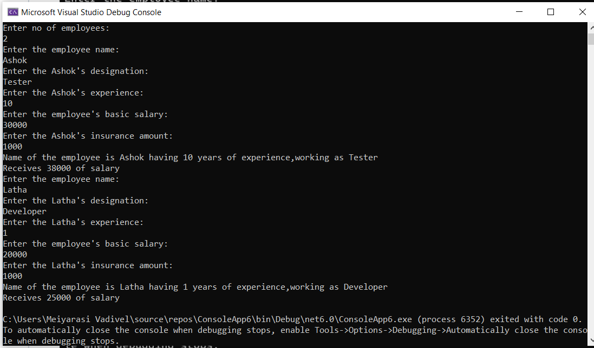

# Ex04-Constructor
## Aim:
 To write a C# program to calculate the salary of an employee by passing the name, designation, noofexperience, basic salary and insurance amount through constructor.
 
 ## Algorithm:
 ### Step1:
 Create a class and a constructor.
 ### Step2:
Get name, designation, experience, basic salary and insurance amount from the User.
 ## Step3:
Call salary method in constructor to calculate salary.
 ## Step4:

Call display method to display the output.
## step5

Stop the program
 
 ## Program:
 ~~~
 Developed by :Meiyarasi.V
 Register no:212221230058
 ~~~
 ~~~
 using System;
namespace ex4
{
   class prog
   {
       public string name, desig;
       public int exp,bs, ins,gs = 0, ta, hra;
       public prog(string name, string desig, int exp, int bs, int ins)
       {
           this.name = name;
           this.desig = desig;
           this.exp = exp;
           this.bs = bs;
           this.ins = ins;
           salary(bs, ins);
           display(name, desig, exp, gs);
       }
       public void salary(int bs,int ins)
       {
           ta = 10 * bs / 100;
           hra = 20 * bs / 100;
           gs = bs + ta + hra - ins;
       }
       public void display(string name, string desig, int exp, int gs)
       {
           Console.WriteLine("Name of the employee is " + name + " having " + exp + " years of experience,working as " + desig);
           Console.WriteLine("Receives " + gs + " of salary");
       }
       class Program
       {
           static void Main(string[] args)
           {
               string name, desig;
               int exp, bs, ins, n;
               Console.WriteLine("Enter no of employees:");
               n = Convert.ToInt32(Console.ReadLine());
               for (int i = 0; i < n; i++)
               {
                   Console.WriteLine("Enter the employee name:");
                   name = Console.ReadLine();
                   Console.WriteLine("Enter the " + name + "'s designation:");
                   desig = Console.ReadLine();
                   Console.WriteLine("Enter the " + name + "'s experience:");
                   exp = Convert.ToInt32(Console.ReadLine());
                   Console.WriteLine("Enter the employee's basic salary:");
                   bs = Convert.ToInt32(Console.ReadLine());
                   Console.WriteLine("Enter the " + name + "'s insurance amount:");
                   ins = Convert.ToInt32(Console.ReadLine());
                   prog emp = new prog(name, desig, exp, bs, ins);
               }

           }
       }
   }
}
 ~~~
 
 ## Output:
 

 ## Result:
 Thus the C# program to calculate the salary of an employee by passing the name, designation, noofexperience, basic salary and insurance amount through constructor is executed successfully.
